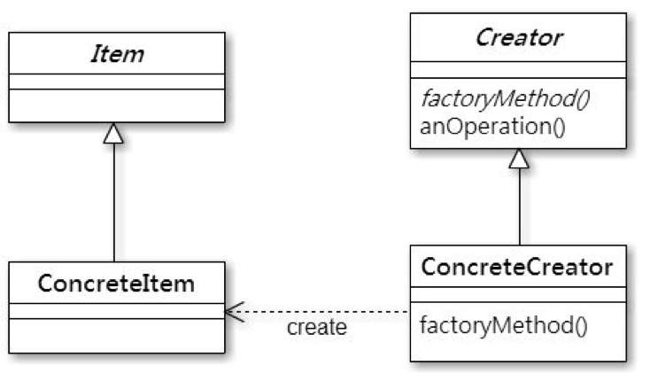
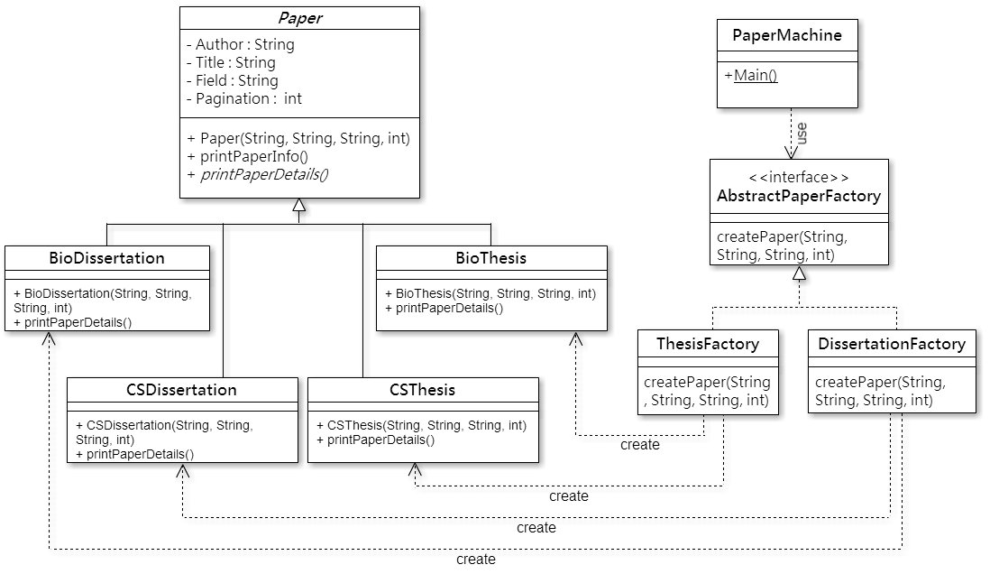

A factory pattern example
=============

**Factory Pattern : **

Factory Pattern定義了產生物件的介面，但是讓子類別決定要實體化哪一個類別的物件，它的概念就是「讓類別將實體化程序交付給子類別作處理」。

Factory pattern class diagram

Item是一個abstract class或是Interface，ConcreteItem是Item的所有子類別的統稱，而Creator是一個abstract class或是Interface，它實作了所有Item共有的method，但不實作factory method，而所有Creator的子類別(統稱ConcreteCreator)都必須實作factory method，透過ConcreteCreator所實作的factory method去決定要實際產生出哪一個ConcreteItem的物件。

Factory Pattern的優點是，在需要依照「特殊應用」或「不同情況」(如：多型)來創造物件時，可以將實體化的程式碼分離，集中封裝在factoryMethod中，減少對ConcreteClass的相依性，在需要增加ConcreteCreator或是ConceteItem的時候，不需要修改到Item及Ceator，讓程式有好的擴充性、維護性。

**Example**

假設要做一個論文製造機的系統，對照Factory pattern class diagram，我們所要製造的Item就是論文(Paper)，而所需要的Creator就是論文工廠，在此例子中宣告為AbstractPaperFactory Interface，而我們又把論文分成碩士論文及博士論文，所以需要的ConcreteCreator分別是ThesisFactory與DissertationFactory，兩者都需要實作AbstractPaperFactory Interface的createPaper函式，除此之外，為了能製造出不同領域的論文，碩士與博士論文還可以選擇要Computer Science或是Biology領域的論文，所以此例子中，ConcreteItem有4個，分別是CSThesis、BioThesis、CSDissertation、BioDissertation，繼承Paper抽象類別，需要實作printPaperDetails函式。

Paper factory class diagram

